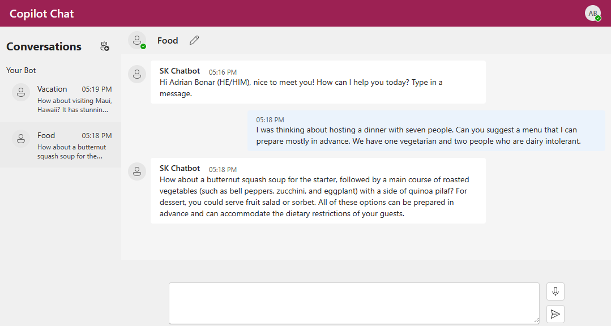
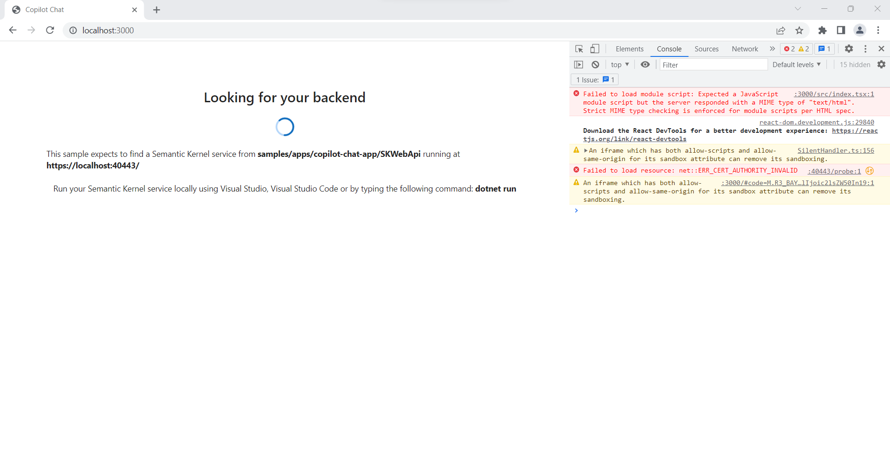

# Copilot Chat Sample Application
>! IMPORTANT  This learning sample is for educational purposes only and should
 not be used in any production use case.  It is intended to highlight concepts of
 Semantic Kernel and not any architectural / Security design practices to be used.

## About the Copilot 
The Copilot Chat sample allows you to build your own integrated large language
model chatbot.  This is an enriched intelligence app, with multiple dynamic
components including command messages, user intent, and memories.  

The chat prompt and response will evolve as the conversation between the user
and the application proceeds.  This chat experience is a chat skill containing
multiple functions that work together to construct the final prompt for each
exchange.

## Dependencies:

Before following these instructions, please ensure your development environment
and these components are functional:
1. [Visual Studio Code](https://code.visualstudio.com/Download)
2. [Git](https://git-scm.com/book/en/v2/Getting-Started-Installing-Git)
3. [.NET 6.0](https://dotnet.microsoft.com/en-us/download/dotnet/6.0)
4. [Node.js](https://nodejs.org/en/download)
5. [Yarn](https://classic.yarnpkg.com/lang/en/docs/install)

## Running the Sample
1. You will need an [Open AI Key](https://platform.openai.com/account/api-keys)
   or Azure Open AI Service Key for this sample.
2. You will need an application registration.
   [Follow the steps to register an app here.](https://learn.microsoft.com/en-us/azure/active-directory/develop/quickstart-register-app)

    1. Select Single-page application (SPA) as platform type, and the redirect
       URI will be `http://localhost:3000`.
    2. Select `Accounts in any organizational directory and personal Microsoft Accounts`
       as supported account types for this sample.
    3. Make a note of this Application (client) ID from the Azure Portal, we will
       make use of it later.
3. The sample uses two applications, a front-end web UI, and a back-end API server.
    First, let’s set up and verify the back-end API server is running.

    1. Navigate to `\samples\apps\copilot-chat-app\SKWebApi`
    2. Update `appsettings.json` with these settings:

          * If you wish to run the back-end API server without an SSL certificate,
            you may change `"UseHttp": false,` to `True` to overide the default
            use of https.

          * Under the `“CompletionConfig”` block, make the following configuration
            changes to match your instance:

            * `“AIService”: “AzureOpenAI”`, or whichever option is appropriate for
              your instance.
            * `“DeploymentOrModelID”: “text-davinci-003”,` or whichever option is
              appropriate for your instance.  
            * `“Endpoint”:` “Your Azure Endpoint address, i.e. `http://contoso.openai.azure.com`”.
              If you are using OpenAI, leave this blank.
            * You will insert your Azure endpoint key during build of the backend
              API Server

        * Under the `“EmbeddingConfig”` block, make sure the following configuration
          changes to match your instance:
            * `“AIService”: “AzureOpenAI”,` or whichever option is appropriate
              for your instance.
            * `“DeploymentOrModelID”: “text-embedding-ada-002”,` or whichever
              option is appropriate for your instance.    
            * You will insert your Azure endpoint key during build of the backend
              API Server
            
4. Build the back-end API server by following these instructions:
    1. In the terminal navigate to  `\samples\apps\copilot-chat-app\SKWebApi`
    2. Run the command: `dotnet user-secrets set "CompletionConfig:Key"  "YOUR OPENAI KEY or AZURE OPENAI KEY"`
    3. Run the command: `dotnet user-secrets set "EmbeddingConfig:Key" "YOUR OPENAI KEY or AZURE OPENAI KEY"`
    4. Execute the command `dotnet build`
    5. Once the build is complete, Execute the command `dotnet run`
    6. Test the back-end server to confirm it is running.
        * Open a web browser, and navigate to `https://localhost:40443/probe`
        * You should see a confirmation message: `Semantic Kernel service is up and running`

>Note: you may need to accept the locally signed certificate on your machine
 in order to see this message.  It is important to do this, as your browser may
 need to accept the certificate before allowing the WebApp to communicate
 with the backend.

>Note: You may need to acknowledge the Windows Defender Firewall, and allow
 the app to communicate over private or public netowrks as appropriate.

5. Now that the back-end API server is setup, and confirmed operating, let’s
   proceed with setting up the front-end WebApp.
    1. Navigate to `\apps\copilot-chat-app\webapp`
    2. Copy `.env.example` into a new file with the name “`.env`” and make the
       following configuration changes to match your instance:
    3. Use the Application (client) ID from the Azure Portal steps above and
       paste the GUID into the `.env` file next to `REACT_APP_CHAT_CLIENT_ID= `
    4. Execute the command `yarn install`
    5. Execute the command `yarn start`

    6. Wait for the startup to complete.
    7. With the back end and front end running, your web browser should automatically
       launch and navigate to `https://localhost:3000`
    8. Sign in in with your Microsoft work or personal account details.
    9. Grant permission to use your account details, this is normally just to
       read your account name.
    10. If you you experience any errors or issues, consult the troubleshooting
        section below.

> !CAUTION: Each chat interaction will call OpenAI which will use tokens that you will be billed for.

## Troubleshooting

If you are stopped at an error message similar to the one above, your browser
may be blocking the front-end access to the back end while waiting for your
permission to connect.
To resolve this, try the following:

1. Confirm the backend service is running by opening a web browser, and navigating
   to `https://localhost:40443/probe`.
2. You should see a confirmation message: `Semantic Kernel service is up and running`
3. If your browser asks you to acknowledge the risks of visiting an insecure
   website, you must acknowledge the message before the front end will be
   allowed to connect to the back-end server.  Please acknowledge, and navigate
   until you see the message Semantic Kernel service is up and running
4. Return to your original browser window, or navigate to `https://localhost:3000`,
   and refresh the page. You should now successfully see the Copilot Chat
   application and can interact with the prompt.

* If you continue to experience trouble using SSL based linking, you may wish to
  run the back-end API server without an SSL certificate, you may change
  `"UseHttp": false,` to `"UseHttp": true,` to overide the default use of https.
